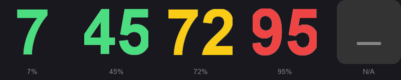
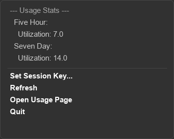

<p align="center">
  
</p>

<h1 align="center">Claude Toolbar</h1>

<p align="center">
  <b>Real-time Claude.ai usage monitor in your Windows system tray</b>
</p>

<p align="center">
  
  
  
</p>

---

## Features

### Live Tray Icon
Your **5-hour usage percentage** displayed as a bold number, color-coded at a glance:

| Usage | Color | Meaning |
|-------|-------|---------|
| 0–60% |  Green | Plenty of capacity |
| 61–85% |  Yellow | Getting close |
| 86–100% |  Red | Near the limit |

### Hover Tooltip

<p align="center">
  
</p>

- **5-hour** and **7-day** usage at a glance
- **Countdown timer** until your next 5-hour reset

### Right-Click Menu

<p align="center">
  
</p>

- Detailed usage breakdown (5h, 7d, extra usage)
- Active session info (context %, model, message count)
- Configurable refresh interval (persisted across restarts)
- Set Session Key / Refresh / Open Usage Page / Quit

---

## Quick Start

### Option 1: Standalone .exe (recommended)

Download `ClaudeToolbar.exe` from [Releases](../../releases) and run it. No Python needed.

### Option 2: Run from source

```bash
pip install -r requirements.txt
python main.py
```

### Option 3: Build the .exe yourself

```bash
pip install -r requirements.txt
python build.py
```

The executable will be at `dist/ClaudeToolbar.exe`.

---

## Setup

On first launch, the app prompts for your **session key**:

1. Open [claude.ai](https://claude.ai) in your browser
2. Press `F12` → **Application** tab → **Cookies** → `claude.ai`
3. Find the cookie named **`sessionKey`**
4. Copy its value and paste into the dialog

> The key is stored locally at `~/.claude/toolbar_config.json`

---

## Configuration

The **refresh interval** can be changed directly from the tray menu via **"Refresh Interval (60s)..."**. The setting is persisted in `~/.claude/toolbar_config.json`.

Default values in `config.py`:

| Setting | Default | Description |
|---------|---------|-------------|
| `REFRESH_INTERVAL` | `60` | Seconds between API refreshes (configurable from tray) |
| `MAX_CONTEXT_TOKENS` | `200,000` | Context window size for token estimation |

---

## How It Works

```
Claude Toolbar
    │
    ├─ Polls claude.ai/api every 60s
    │   ├─ /organizations/{org}/usage        → 5h & 7d utilization %
    │   └─ /organizations/{org}/conversations → active session context
    │
    ├─ Uses curl_cffi (Chrome TLS fingerprint) to bypass Cloudflare
    │
    └─ Renders usage as a colored number in the system tray
```

## Dependencies

| Package | Purpose |
|---------|---------|
| [`pystray`](https://pypi.org/project/pystray/) | System tray icon |
| [`Pillow`](https://pypi.org/project/Pillow/) | Icon image rendering |
| [`curl_cffi`](https://pypi.org/project/curl-cffi/) | HTTP client (Cloudflare bypass) |

## Requirements

- Windows 10/11
- Python 3.10+ (for source/build)
- [Claude Pro or Team](https://claude.ai) account

---

## License

MIT
